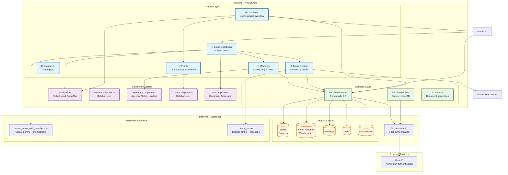
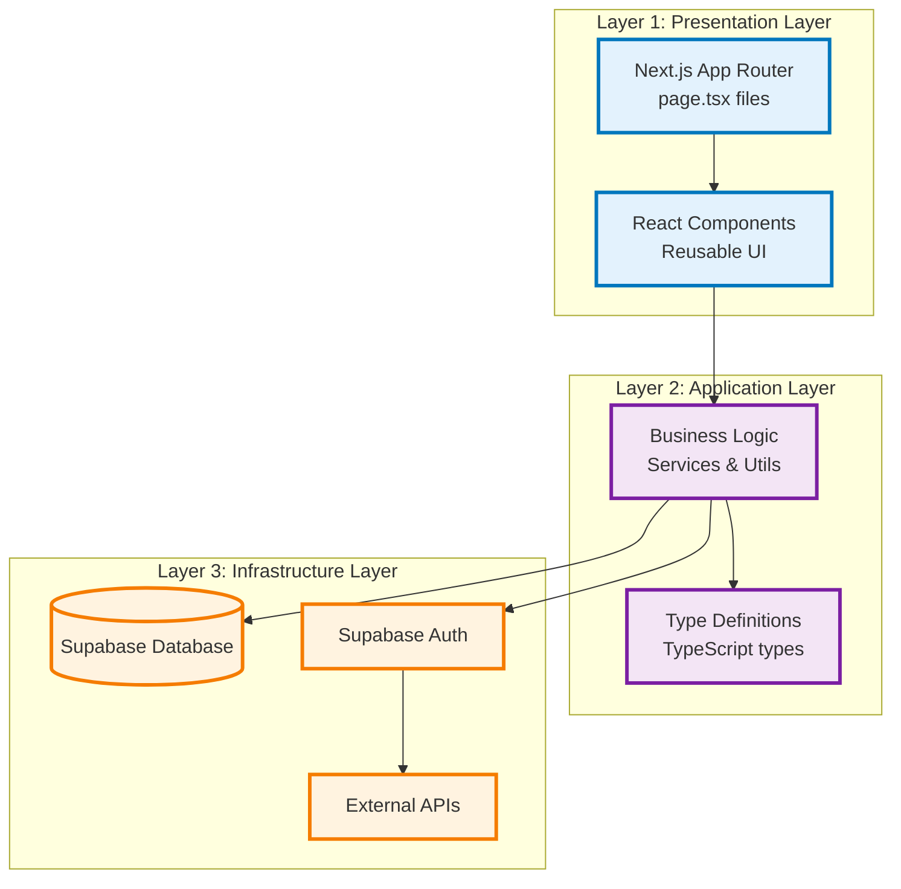
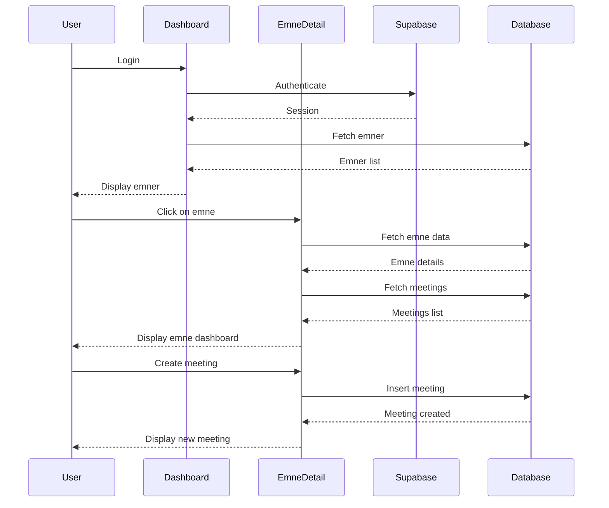

# Kollokvie.no - Architecture Documentation

## Package Diagram

## System Layers

## Data Flow

## Key Features by Module

- **Authentication**: Supabase Auth + BankID integration
- **Dashboard**: User overview and navigation
- **Emner**: Subject-based collaborative learning
- **Meetings**: Schedule, agenda, rotating leadership
- **Knowledge Base**: AI-powered document generation
- **Tasks**: Task management per emne
- **User Management**: Profile, deletion, settings

## Technology Stack

- **Framework**: Next.js 15 (App Router)
- **Language**: TypeScript
- **Styling**: Tailwind CSS
- **Database**: Supabase (PostgreSQL)
- **Auth**: Supabase Auth + BankID
- **AI**: Mock AI service (extensible)

