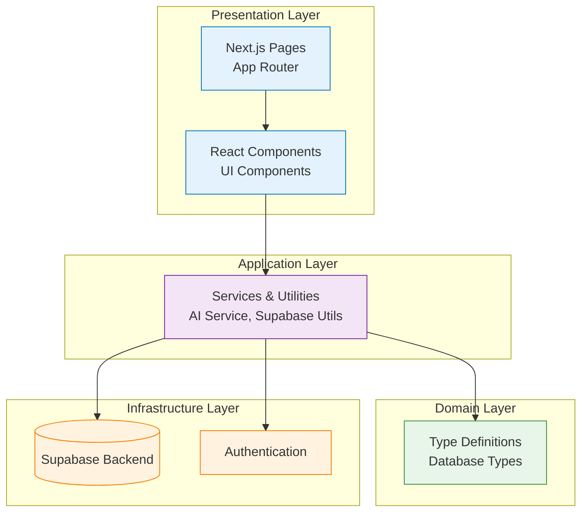
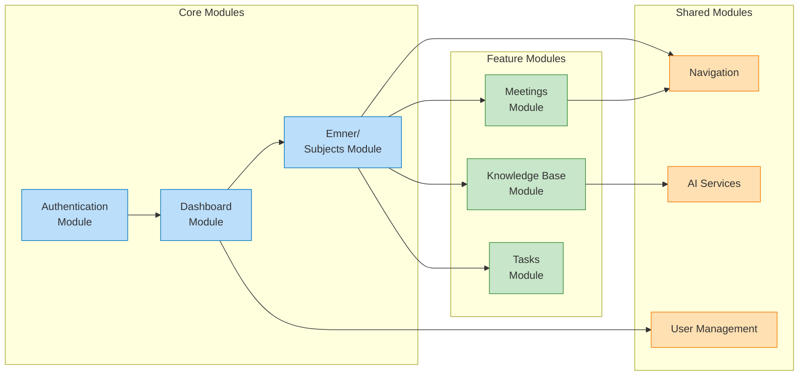

# Kollokvie.no - Architecture Overview

> **Note:** The diagrams have been split into separate files for better Mermaid compatibility.
> View them in the `docs/` folder:
> - [Package Diagram](./package-diagram.md)
> - [Layer Architecture](./layer-architecture.md)  
> - [Module Dependencies](./module-dependencies.md)
> - [Data Flow](./data-flow.md)

## Package Diagram Overview

```mermaid
graph TB
    subgraph "Client Layer"
        Browser[Browser]
    end

    subgraph "Next.js App Router"
        subgraph "Pages (App Router)"
            Page[Home Page]
            LoginPage[Login Page]
            
            subgraph "Dashboard Module"
                Dashboard[Dashboard Page]
                DashboardLayout[Dashboard Layout]
                ProfilePage[Profile Page]
            end
            
            subgraph "Emner Module"
                EmnerList[Emner List Page]
                EmnerNew[New Emne Page]
                EmnerLayout[Emne Layout]
                
                subgraph "Emne Details"
                    EmneDetail[Emne Dashboard]
                    EmneInnstillinger[Settings Page]
                    EmneMedlemmer[Members Page]
                    EmneKunnskapsbank[Knowledge Base]
                    EmneDocumentView[Document View]
                    EmneOppgaver[Tasks Page]
                    EmneMoteList[Meetings List]
                    EmneMoteNew[New Meeting]
                    EmneMoteDetail[Meeting Detail]
                end
            end
            
            subgraph "Other Pages"
                MineBidrag[My Contributions]
                UpcomingMeetings[Upcoming Meetings]
            end
            
            AuthCallback[Auth Callback Route]
        end
        
        subgraph "Components Layer"
            subgraph "Navigation"
                GlobalNav[Global Navigation]
                EmneNav[Emne Navigation]
            end
            
            subgraph "Emner Components"
                EmneDeletion[Emne Deletion]
            end
            
            subgraph "Meeting Components"
                AgendaItem[Agenda Item]
                LiveNotes[Live Notes]
                RotatingLeader[Rotating Leader]
                RotatingLeaderWrapper[Rotating Leader Wrapper]
            end
            
            subgraph "User Components"
                UserDeletion[User Deletion]
            end
            
            subgraph "AI Components"
                DocumentGenerator[Document Generator]
                DocumentGeneratorWrapper[Document Generator Wrapper]
            end
        end
        
        subgraph "Services & Utils"
            subgraph "Supabase Integration"
                SupabaseClient[Supabase Client<br/>client.ts]
                SupabaseServer[Supabase Server<br/>server.ts]
                SupabaseMiddleware[Supabase Middleware<br/>middleware.ts]
            end
            
            AIService[AI Service]
        end
        
        subgraph "Types"
            DatabaseTypes[Database Types<br/>database.ts]
        end
    end
    
    subgraph "Supabase Backend"
        subgraph "Database Tables"
            EmneTable[emne]
            EmneMembersTable[emne_members]
            MeetingsTable[meetings]
            AgendaItemsTable[agenda_items]
            TasksTable[tasks]
            ContributionsTable[contributions]
            MasterDocsTable[master_documents]
            ProgressGoalsTable[progress_goals]
        end
        
        subgraph "Database Functions"
            CreateEmneFunc[create_emne_with_membership]
            DeleteEmneFunc[delete_emne]
        end
        
        Auth[Supabase Auth]
    end
    
    subgraph "External Services"
        BankID[BankID<br/>Authentication]
    end
    
    %% User Flow
    Browser --> Page
    Browser --> LoginPage
    LoginPage --> AuthCallback
    LoginPage --> Dashboard
    
    %% Dashboard Flow
    Dashboard --> GlobalNav
    Dashboard --> EmneList
    Dashboard --> ProfilePage
    ProfilePage --> UserDeletion
    
    %% Emner Flow
    EmneList --> EmneNew
    EmneList --> EmneDetail
    EmneDetail --> EmneLayout
    EmneLayout --> EmneNav
    EmneLayout --> EmneInnstillinger
    EmneLayout --> EmneKunnskapsbank
    EmneLayout --> EmneMoteList
    EmneLayout --> EmneOppgaver
    EmneLayout --> EmneMedlemmer
    
    EmneNew --> CreateEmneFunc
    EmneInnstillinger --> EmneDeletion
    EmneDeletion --> DeleteEmneFunc
    
    EmneMoteNew --> EmneMoteDetail
    EmneMoteDetail --> AgendaItem
    EmneMoteDetail --> LiveNotes
    EmneMoteDetail --> RotatingLeader
    EmneMoteDetail --> RotatingLeaderWrapper
    
    EmneKunnskapsbank --> EmneDocumentView
    EmneDocumentView --> DocumentGenerator
    DocumentGeneratorWrapper --> DocumentGenerator
    DocumentGeneratorWrapper --> AIService
    
    %% Data Access
    Dashboard --> SupabaseServer
    EmneList --> SupabaseServer
    EmneDetail --> SupabaseServer
    EmneInnstillinger --> SupabaseServer
    EmneMoteDetail --> SupabaseServer
    ProfilePage --> SupabaseServer
    LoginPage --> SupabaseClient
    
    SupabaseServer --> EmneTable
    SupabaseServer --> EmneMembersTable
    SupabaseServer --> MeetingsTable
    SupabaseServer --> AgendaItemsTable
    SupabaseServer --> TasksTable
    SupabaseServer --> ContributionsTable
    SupabaseServer --> MasterDocsTable
    SupabaseServer --> ProgressGoalsTable
    
    SupabaseClient --> Auth
    SupabaseServer --> Auth
    Auth --> BankID
    
    %% Component Dependencies
    GlobalNav --> SupabaseClient
    EmneNav --> SupabaseClient
    
    %% Type Definitions
    Dashboard -.-> DatabaseTypes
    EmneDetail -.-> DatabaseTypes
    AIService -.-> DatabaseTypes
    
    %% Styling
    classDef pageClass fill:#e1f5ff,stroke:#01579b,stroke-width:2px
    classDef componentClass fill:#f3e5f5,stroke:#4a148c,stroke-width:2px
    classDef serviceClass fill:#e8f5e9,stroke:#1b5e20,stroke-width:2px
    classDef dbClass fill:#fff3e0,stroke:#e65100,stroke-width:2px
    
    class Dashboard,ProfilePage,EmneList,EmneNew,EmneDetail,Page,LoginPage pageClass
    class GlobalNav,EmneNav,EmneDeletion,AgendaItem,UserDeletion,DocumentGenerator componentClass
    class SupabaseServer,SupabaseClient,AIService serviceClass
    class EmneTable,EmneMembersTable,MeetingsTable dbClass
```

Click to view Package Diagram

## Layer Architecture

Click to view Layer Architecture

## Module Dependencies

Click to view Module Dependencies

