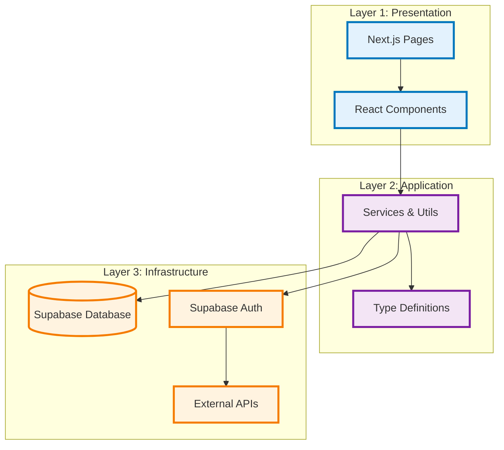

# Layer Architecture - Kollokvie.no

```mermaid
graph TB
    subgraph "Layer 1: Presentation"
        Pages[Next.js Pages]
        Components[React Components]
    end
    
    subgraph "Layer 2: Application"
        Services[Services & Utils]
        Types[Type Definitions]
    end
    
    subgraph "Layer 3: Infrastructure"
        Supabase[(Supabase Database)]
        Auth[Supabase Auth]
        External[External APIs]
    end
    
    Pages --> Components
    Components --> Services
    Services --> Types
    Services --> Supabase
    Services --> Auth
    Auth --> External
    
    classDef layer1 fill:#e3f2fd,stroke:#0277bd,stroke-width:3px
    classDef layer2 fill:#f3e5f5,stroke:#7b1fa2,stroke-width:3px
    classDef layer3 fill:#fff3e0,stroke:#f57c00,stroke-width:3px
    
    class Pages,Components layer1
    class Services,Types layer2
    class Supabase,Auth,External layer3
```

