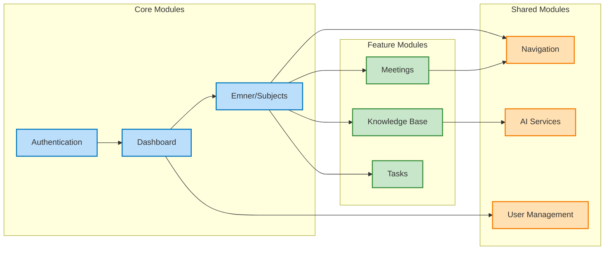

# Module Dependencies - Kollokvie.no

```mermaid
graph LR
    subgraph "Core Modules"
        AUTH[Authentication]
        DASH[Dashboard]
        EMNER[Emner/Subjects]
    end
    
    subgraph "Feature Modules"
        MOTE[Meetings]
        DOCS[Knowledge Base]
        TASKS[Tasks]
    end
    
    subgraph "Shared Modules"
        NAV[Navigation]
        AI[AI Services]
        USER[User Management]
    end
    
    AUTH --> DASH
    DASH --> EMNER
    EMNER --> MOTE
    EMNER --> DOCS
    EMNER --> TASKS
    
    MOTE --> NAV
    DOCS --> AI
    DASH --> USER
    EMNER --> NAV
    
    classDef core fill:#bbdefb,stroke:#0277bd,stroke-width:2px
    classDef feature fill:#c8e6c9,stroke:#388e3c,stroke-width:2px
    classDef shared fill:#ffe0b2,stroke:#f57c00,stroke-width:2px
    
    class AUTH,DASH,EMNER core
    class MOTE,DOCS,TASKS feature
    class NAV,AI,USER shared
```

