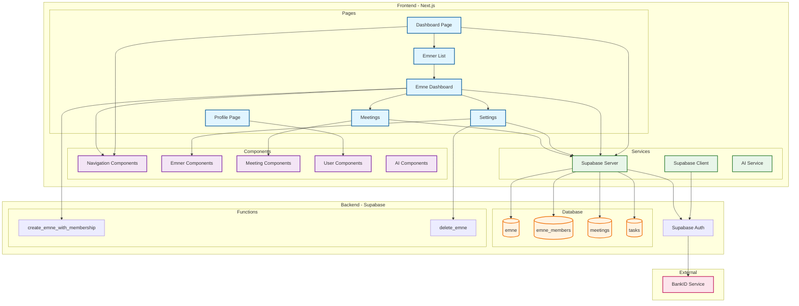

# Package Diagram - Kollokvie.no

```mermaid
graph TB
    subgraph "Frontend - Next.js"
        subgraph "Pages"
            Dashboard[Dashboard Page]
            Profile[Profile Page]
            EmnerList[Emner List]
            EmneDetail[Emne Dashboard]
            Settings[Settings]
            Meetings[Meetings]
        end
        
        subgraph "Components"
            Nav[Navigation Components]
            EmnerComp[Emner Components]
            MeetingComp[Meeting Components]
            UserComp[User Components]
            AIComp[AI Components]
        end
        
        subgraph "Services"
            SupabaseClient[Supabase Client]
            SupabaseServer[Supabase Server]
            AIService[AI Service]
        end
    end
    
    subgraph "Backend - Supabase"
        subgraph "Database"
            EmneDB[(emne)]
            MembersDB[(emne_members)]
            MeetingsDB[(meetings)]
            TasksDB[(tasks)]
        end
        
        subgraph "Functions"
            CreateFunc[create_emne_with_membership]
            DeleteFunc[delete_emne]
        end
        
        Auth[Supabase Auth]
    end
    
    subgraph "External"
        BankID[BankID Service]
    end
    
    Dashboard --> EmnerList
    EmnerList --> EmneDetail
    EmneDetail --> Settings
    EmneDetail --> Meetings
    
    Dashboard --> Nav
    EmneDetail --> Nav
    Settings --> EmnerComp
    Meetings --> MeetingComp
    Profile --> UserComp
    
    Dashboard --> SupabaseServer
    EmneDetail --> SupabaseServer
    Settings --> SupabaseServer
    Meetings --> SupabaseServer
    
    Settings --> DeleteFunc
    EmneDetail --> CreateFunc
    
    SupabaseServer --> EmneDB
    SupabaseServer --> MembersDB
    SupabaseServer --> MeetingsDB
    SupabaseServer --> TasksDB
    
    SupabaseClient --> Auth
    SupabaseServer --> Auth
    Auth --> BankID
    
    classDef page fill:#e1f5ff,stroke:#01579b,stroke-width:2px
    classDef component fill:#f3e5f5,stroke:#7b1fa2,stroke-width:2px
    classDef service fill:#e8f5e9,stroke:#2e7d32,stroke-width:2px
    classDef db fill:#fff3e0,stroke:#ef6c00,stroke-width:2px
    classDef external fill:#fce4ec,stroke:#c2185b,stroke-width:2px
    
    class Dashboard,Profile,EmnerList,EmneDetail,Settings,Meetings page
    class Nav,EmnerComp,MeetingComp,UserComp,AIComp component
    class SupabaseClient,SupabaseServer,AIService service
    class EmneDB,MembersDB,MeetingsDB,TasksDB db
    class BankID external
```

